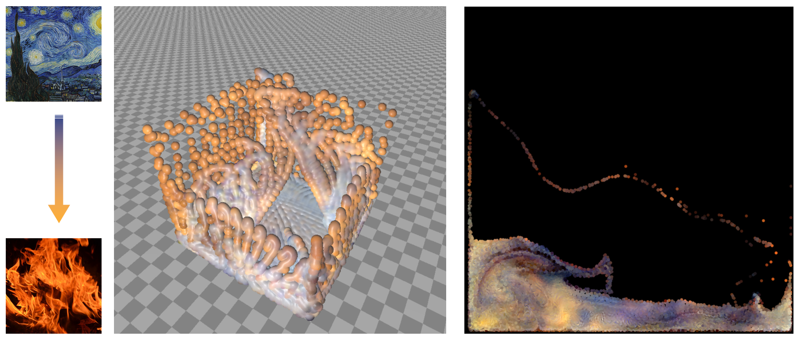

# Real-time Neural Style Transfer For Particle-based Fluid Simulations

Yangzesheng Sun, University of Minnesota

Yuxuan Huang, University of Minnesota

[Video presentation](https://www.youtube.com/watch?v=Z4LF9HDzJl8)



## Absctract
Machine learning methods have been widely used for artistic content generation in both 2D and 3D domains. Combined with differentiable simulation
and rendering, neural style transfer has been employed to artistically manipulate the visual effects of physical simulations. Nevertheless, existing
methods require the simulation to be performed separately from stylization,
and the stylization cannot be performed in real time. To address this problem, we developed a fast neural style transfer method for fluid simulations
at interactive frame rates. Due to the large computational cost of neural
style transfer, we performed style transfer asynchronously from the simulation and used a closed-form style transfer method to avoid expensive
backpropagation through the neural network. We utilized a differentiable
fluid simulator and a differentiable particle renderer to optimize particle
attributes, such as color and velocity, towards stylized keyframes produced
by the neural network. The optimization is performed concurrently with the
dynamics of the simulation which ensures time coherence without much
performance penalty. Our methods is up to 80 times faster than existing
particle-based style transfer methods while also compromising the sharpness
of the stylized simulation effects.

## Usage
```
mpiexec -np 2 python  main.py [-h] [-d {2,3}] [-m {sph,mpm}] [-n NPART]
               [-g GRIDSIZE] [-dt DT] [--lr LR] [--res RES] 
               [--views VIEWS] [--viewres VIEWRES] [--warmup WARMUP]
               style_img [style_img ...]

Stylized fluid simulation

positional arguments:
  style_img             Path to style images (one or more)

optional arguments:
  -h, --help            show this help message and exit
  -d {2,3}, --dim {2,3}
                        Dimensions
  -m {sph,mpm}, --method {sph,mpm}
                        Simulation method
  -n NPART, --npart NPART
                        Number of particles
  -g GRIDSIZE, --gridsize GRIDSIZE
                        Grid size
  -dt DT                Time step
  --lr LR               Base learning rate
  --res RES             Window resolution
  --views VIEWS         Number of views for differentiable rendering (3D only)
  --viewres VIEWRES     Views resolution for differentiable rendering (3D
                        only)
  --warmup WARMUP       Number of warmup frames
```

## Controls
* Use SPACE to pause and start the simulation.
* Use ENTER to switch style images when multiple style images are provided in the arguments
* (3D simulation) Drag using the left mouse button to orbit the camera.
* (3D simulation) Drag using the middle mouse button to pan the camera.
* (3D simulation) Use the mouse wheel or drag using the right mouse button to zoom the camera.

## Requirements
* [Taichi](https://taichi.graphics/) 0.7.10
* [PyTorch](https://pytorch.org/) 1.7.0 
* [mpi4py](https://mpi4py.readthedocs.io/en/stable/)


